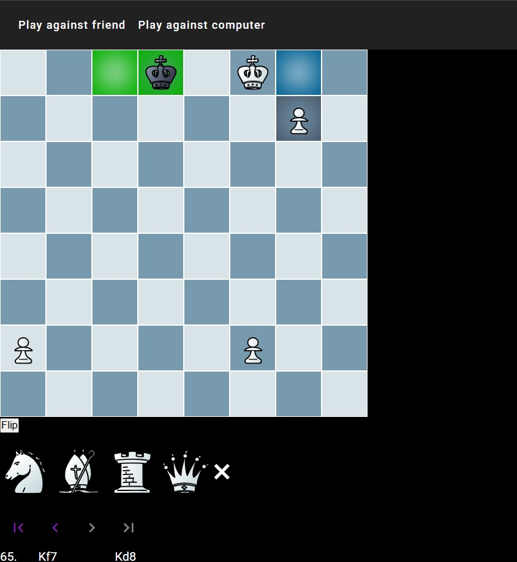
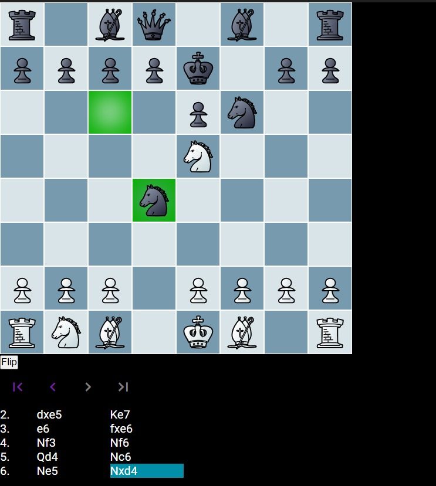
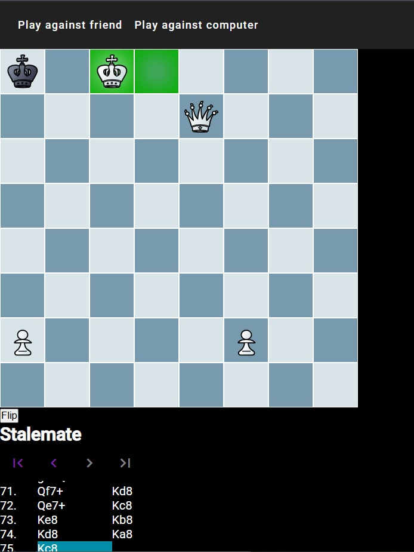

<div align="center">


<br>

# ♟️ Chess Game

<pre>

 ██████╗██╗  ██╗███████╗███████╗███████╗
██╔════╝██║  ██║██╔════╝██╔════╝██╔════╝
██║     ███████║█████╗  ███████╗███████╗
██║     ██╔══██║██╔══╝  ╚════██║╚════██║
╚██████╗██║  ██║███████╗███████║███████║
 ╚═════╝╚═╝  ╚═╝╚══════╝╚══════╝╚══════╝

</pre>

### A Modern Browser-Based Chess Experience Powered by Angular & Stockfish AI

Play against your friends, challenge a chess engine, track every move, and experience professional chess mechanics directly in the browser.

</div>

---

# Gameplay Preview

<p align="center">

</p>

---

# Multiple Ways to Play

<table>
<tr>

<td align="center" width="50%">

### 🤖 Play Against Computer

Challenge the Stockfish Engine with multiple AI difficulty levels.


</td>

<td align="center" width="50%">

### 🔄 Flip Board

Instantly reverse the board orientation for both sides.



</td>

</tr>
</table>

---

# Intelligent Game State Detection

<p align="center">

</p>

The game continuously evaluates the entire board after every move.

It correctly identifies

- ✅ Check
- ✅ Checkmate
- ✅ Stalemate
- ✅ Illegal Moves
- ✅ Captures
- ✅ Turn Changes

without requiring any manual intervention.

---

# The Problem

Creating a chess game isn't about drawing an 8×8 board.

The real challenge lies in implementing the hundreds of rules that govern every legal move.

Every move must answer questions like:

- Is the move legal?
- Is the king left in check?
- Does this create checkmate?
- Is the position a stalemate?
- Can this piece actually move there?
- Should the turn change?
- Should the AI respond?

This project solves those problems by implementing a complete chess engine in TypeScript and combining it with a responsive Angular interface.

The result is a smooth, accurate, and enjoyable chess experience for both casual players and enthusiasts.

---

# Features

| Feature | Description |
|----------|-------------|
| ♟️ Two Game Modes | Play locally against another player or challenge the computer |
| 🤖 Stockfish AI | Five selectable AI difficulty levels |
| ✅ Complete Chess Rules | Full move validation for every piece |
| 👑 Check Detection | Automatically identifies check situations |
| 🏆 Checkmate Detection | Ends the game when checkmate occurs |
| 🤝 Stalemate Detection | Correctly recognizes drawn positions |
| 📜 Move History | Records every move using algebraic notation |
| 🔄 Flip Board | View the board from either player's perspective |
| 🎯 Legal Move Highlighting | Highlights valid destinations for selected pieces |
| 🔊 Sound Effects | Interactive move and capture sounds |
| 🎨 Modern UI | Responsive interface built with Angular and SCSS |

---

# Why This Project?

Instead of relying on a third-party chess library to manage the game, this project focuses on understanding how a real chess engine works internally.

It demonstrates

- Object-oriented programming
- State management
- Recursive board evaluation
- Algorithmic move validation
- AI integration
- Component-based frontend architecture
- Real-time UI synchronization

The application was designed as both a playable chess game and a software engineering project demonstrating complex application logic.

---

# Architecture

```

                        USER INPUT
                             │
                             ▼
                  Piece Selection Handler
                             │
                             ▼
                  Move Validation Engine
                             │
             ┌───────────────┼───────────────┐
             │                               │
      Invalid Move                     Valid Move
             │                               │
             ▼                               ▼
      Ignore Request               Update Board State
                                             │
                                             ▼
                              Check / Checkmate Detection
                                             │
                                             ▼
                                  Move History Update
                                             │
                                             ▼
                           Render Updated Chess Board
                                             │
                                             ▼
                             AI Turn (Stockfish Engine)
                                             │
                                             ▼
                                  Update Board Again

```

---

# Technology Stack

| Technology | Purpose |
|------------|----------|
| Angular | Frontend Framework |
| TypeScript | Core Game Logic |
| HTML5 | Interface Structure |
| SCSS | Styling |
| Stockfish API | Artificial Intelligence |
| JavaScript | Browser Runtime |

---

# Core Components

The application is divided into several logical systems.

## 🎮 Game Engine

Responsible for

- Piece movement
- Move validation
- Captures
- Turn management
- Rule enforcement

---

## 🤖 AI Engine

Communicates with the Stockfish API.

Responsibilities

- Position evaluation
- Best move calculation
- Difficulty scaling
- AI response generation

---

## 🖥 User Interface

Built with Angular components.

Includes

- Interactive chessboard
- Move history
- Piece highlighting
- Sound effects
- Responsive controls

---

# Chess Engine Workflow

```

Player Click

      │

      ▼

Select Piece

      │

      ▼

Generate Legal Moves

      │

      ▼

Player Chooses Destination

      │

      ▼

Validate Move

      │

      ├──────── Invalid

      │            │

      │            ▼

      │      Reject Move

      │

      ▼

Execute Move

      │

      ▼

Check Game State

      │

      ├── Check

      ├── Checkmate

      ├── Stalemate

      └── Continue

      │

      ▼

Switch Turn

      │

      ▼

Render Updated Board

```

---

# Project Highlights

✔ Modern Angular Architecture

✔ Strongly Typed TypeScript Codebase

✔ Modular Chess Logic

✔ AI Integration

✔ Interactive User Experience

✔ Responsive Design

✔ Smooth Gameplay

✔ Accurate Chess Rules

---

# Screenshot Gallery

### Checkmate Example

<p align="center">

</p>

> The game automatically evaluates every position to determine whether the match should continue, end in checkmate, or be declared a stalemate.

---
# Project Structure

```
Chess-Game/
│
├── Chess-Game/
│   ├── src/
│   │
│   ├── app/
│   │   ├── chess-logic/
│   │   │   ├── board/
│   │   │   ├── pieces/
│   │   │   ├── validators/
│   │   │   ├── ai/
│   │   │   ├── game/
│   │   │   └── utilities/
│   │   │
│   │   ├── components/
│   │   ├── pages/
│   │   ├── services/
│   │   ├── models/
│   │   ├── app.component.*
│   │   └── app.module.ts
│   │
│   ├── assets/
│   │   ├── pieces/
│   │   ├── sounds/
│   │   └── icons/
│   │
│   ├── environments/
│   ├── styles.scss
│   └── index.html
│
├── screenshots/
│   └── Pictures/
│
├── README.md
├── LICENSE
├── angular.json
├── package.json
└── tsconfig.json
```

---

# How the Chess Engine Works

Unlike simple board demonstrations, every move passes through multiple validation layers before being accepted.

```
Player selects piece
        │
        ▼
Generate all possible moves
        │
        ▼
Filter illegal moves
        │
        ▼
Would own king be in check?
        │
 ┌──────┴──────┐
 │             │
No            Yes
 │             │
 ▼             ▼
Execute      Reject
Move         Move
 │
 ▼
Update Board
 │
 ▼
Check Game State
 │
 ▼
Render UI
 │
 ▼
Computer Move (Optional)
```

---

# Artificial Intelligence

The computer opponent is powered by the **Stockfish Chess Engine**, one of the strongest chess engines ever developed.

The Angular application communicates with the Stockfish API by

1. Sending the current board position.
2. Selecting the requested difficulty level.
3. Receiving the best move.
4. Updating the board.
5. Checking for game-ending conditions.

This allows players to practice against increasingly stronger opponents while keeping the frontend lightweight.

---

# Supported Features

| Category | Supported |
|----------|-----------|
| Local Multiplayer | ✅ |
| Play vs AI | ✅ |
| Five AI Levels | ✅ |
| Check Detection | ✅ |
| Checkmate Detection | ✅ |
| Stalemate Detection | ✅ |
| Move Validation | ✅ |
| Piece Captures | ✅ |
| Move History | ✅ |
| Board Flip | ✅ |
| Highlight Legal Moves | ✅ |
| Responsive Interface | ✅ |
| Sound Effects | ✅ |

---

# Gameplay Screenshots

## Playing Against the Computer

<p align="center">

</p>

---

## Hard Difficulty (Level 5)

<p align="center">

</p>

---

## Flip Board

<p align="center">

</p>

---

## Stalemate Detection

<p align="center">

</p>

---

# Installation

## 1. Clone the repository

```bash
git clone https://github.com/Shahrukh-aidev/Chess-Game.git
```

---

## 2. Enter the project

```bash
cd Chess-Game/Chess-Game
```

---

## 3. Install dependencies

```bash
npm install
```

---

## 4. Start the development server

```bash
ng serve
```

---

## 5. Open in Browser

```
http://localhost:4200
```

---

# Requirements

- Node.js 18+
- npm
- Angular CLI

Install Angular CLI if needed.

```bash
npm install -g @angular/cli
```

---

# Skills Demonstrated

This project demonstrates practical experience with

- Angular Development
- TypeScript
- Object-Oriented Programming
- State Management
- Recursive Algorithms
- Data Structures
- API Integration
- Software Architecture
- Responsive UI Design
- Chess Rule Implementation
- Frontend Engineering

---

# Future Improvements

- Online Multiplayer
- WebSocket Support
- User Authentication
- Player Profiles
- Game Saving
- PGN Import & Export
- Opening Explorer
- Timers
- ELO Rating System
- Undo / Redo
- Puzzle Mode
- Mobile Optimizations

---

# Performance

✔ Fast move validation

✔ Smooth board rendering

✔ Modular architecture

✔ Strong typing with TypeScript

✔ Maintainable component structure

✔ Lightweight frontend

---

# Learning Outcomes

Building this project required solving problems involving

- Complex conditional logic
- Algorithm design
- Component communication
- Game state synchronization
- Chess rule implementation
- API communication
- Frontend optimization

It serves as both a playable chess application and a demonstration of software engineering principles.

---

# Contributing

Contributions are welcome.

If you'd like to improve the project:

1. Fork the repository.
2. Create a new branch.

```bash
git checkout -b feature/new-feature
```

3. Commit your changes.

```bash
git commit -m "Added new feature"
```

4. Push to GitHub.

```bash
git push origin feature/new-feature
```

5. Open a Pull Request.

---

# License

This project is licensed under the **Apache License 2.0**.

See the **LICENSE** file for complete details.

---

<div align="center">

## ⭐ If you found this project useful, consider giving it a star!

It helps others discover the project and motivates future improvements.

<br>

**Built with ❤️ using Angular, TypeScript, SCSS, and Stockfish AI**

</div>
